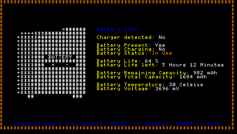

# NeoPspFetch

NeoPspFetch is a PSP homebrew inspired by NeoFetch on Linux.

## Screenshots





## Features

- **NeoFetch like UI:** Display informations along a cool ascii art, in the way of NeoFetch on Linux.
- **System Info:** Show firmware version, factory firmware version, motherboard model and more.
- **Battery Info:** Show battery status, capacity, temperature, and more. 
- **Signed Homebrew:** NeoPspFetch run on official and custom firmwares.

## Disclaimer

Untested on PSP 3000 and PSP E1000 series (I do not own those) but should run without issues.

Tested with official Sony and Ostent batteries. Compatibility with third-party brands may varie. 


## Installation

1. **Download the latest release** from [Releases](https://github.com/Wyped/NeoPspFetch/releases).
2. **Extract the contents** of the ZIP archive.
3. **Copy the `NeoPspFetch` folder** to your PSP's `/PSP/GAME/` directory.
4. **Launch NeoPspFetch** from the XMB.

## Usage

NeoPspFetch is signed and can be run on official and custom firmware.

- Run NeoPspFetch. 
- Use `LEFT` and `RIGHT` arrows to switch between pages.
- Press `SELECT` to take a screenshot. Screenshot will be saved in ms0:/PICTURE/NeoPspFetch.
- Press `START` to exit.

## Build Instructions

If you want to build NeoPspFetch from source:

1. **Clone the repository:**
   ```bash
   git clone https://github.com/Wyped/NeoPspFetch.git
   ```
2. **Setup the PSP SDK** (see [pspdev](https://pspdev.github.io/) for instructions).
3. **Create build directory:**
   ```bash
   mkdir build
   cd build
   ```
4. **Build using CMake:**
   ```bash
   psp-cmake..
   make
   ```
5. **(Optional) Sign with PSCrypter 2.0**
- Use [PSCrypter 2.0](https://www.brewology.com/downloads/download.php?id=12450&mcid=1) to sign the EBOOT.PBP. (Required to run on official firmware).

## Credits

- Kernel detection code from [pspIdent](https://github.com/Yoti/psp_pspident/)  by Yoti and friends. Big thanks to them!

- [LibPspExploit](https://github.com/PSP-Archive/LibPspExploit)

- [PSPDEV SDK](https://pspdev.github.io/)

- Everybody who contributed to the PSP hacking scene.

## License

This project is licensed under the MIT License. See [LICENSE](LICENSE) for details.

---
